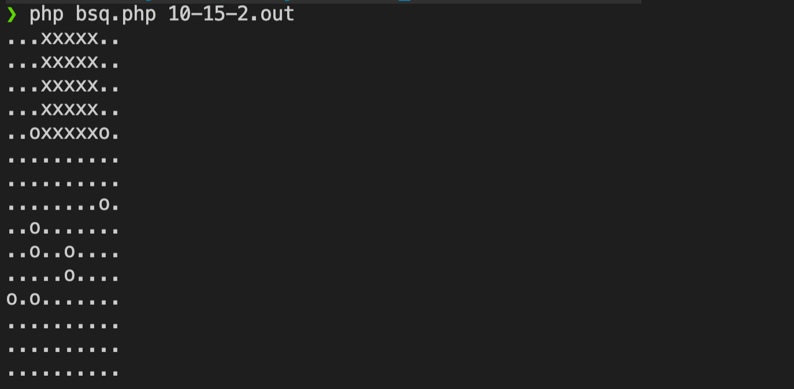

# ALG_BSQ

## How to generate your file *(square)*

```bash
perl generator.pl x y density > file
```

## How to start the programm

```bash
php bsq.php file
```

**Exemple :**

```bash
perl generator.pl 10 15 2 > 10-15-2.out
php bsq.php 10-15-2.out
```

## Preview 



